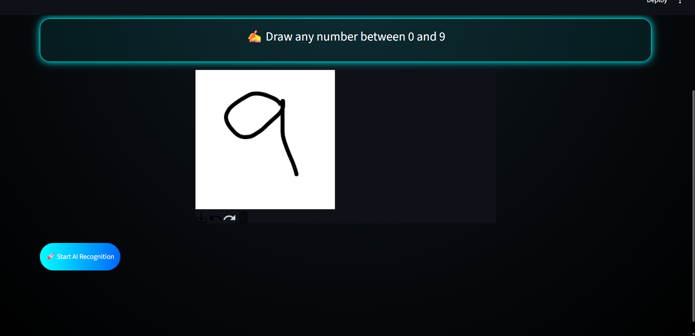
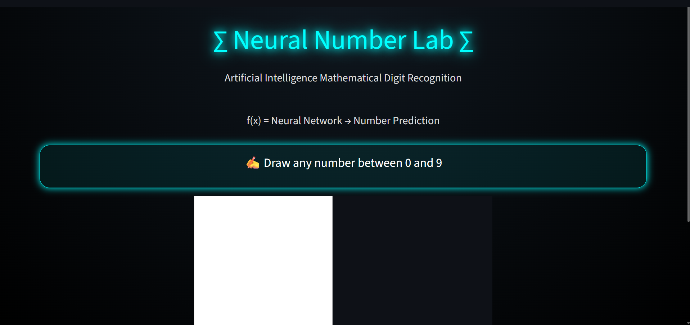
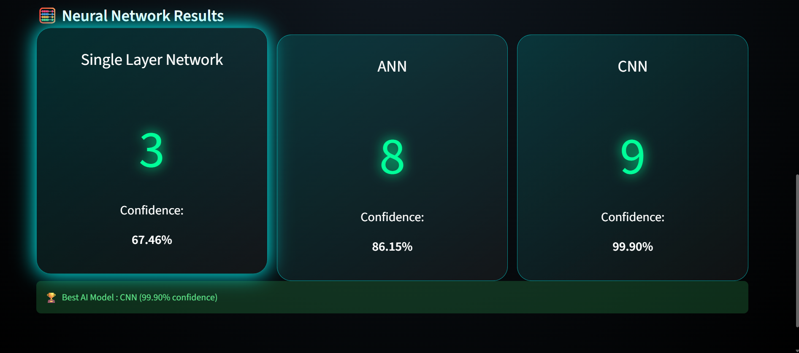

# ∑ Neural Number Lab

Handwritten Digit Recognition using Deep Learning.

## Preview

## Features

- Draw digit using interactive canvas
- Compare 3 models:
  - Single Layer Neural Network
  - ANN
  - CNN
- Confidence score prediction
- Best model selection
- AI thinking animation
- Mathematical themed UI

## Technologies

- Python
- TensorFlow/Keras
- Streamlit
- NumPy
- PIL

## Models

### Single Layer Network
Simple neural network classifier.

### ANN
Dense neural network with ReLU layers.

### CNN
Convolutional neural network for image recognition.

## Dataset

MNIST Handwritten Digit Dataset

Images:
28×28 grayscale

Classes:
0-9
